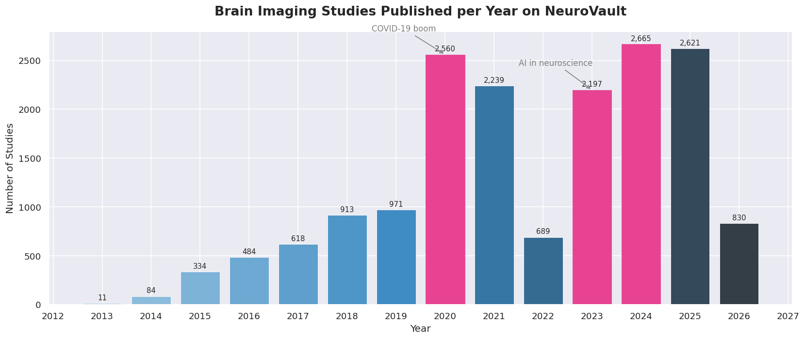
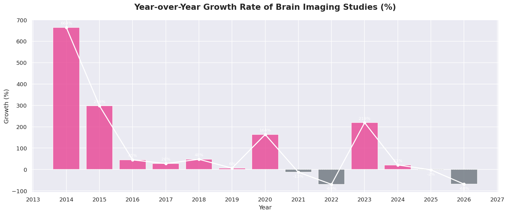
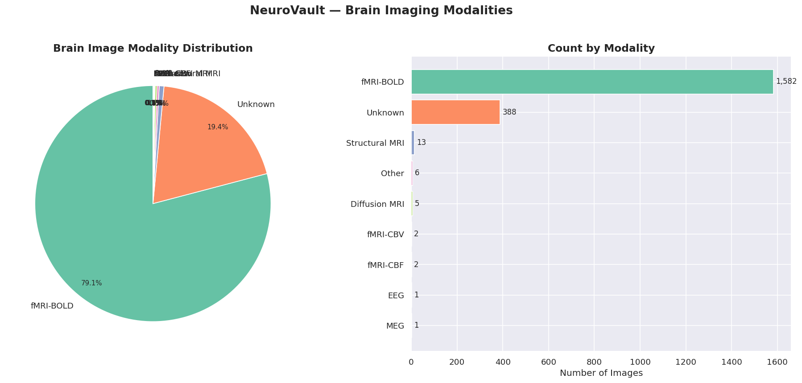
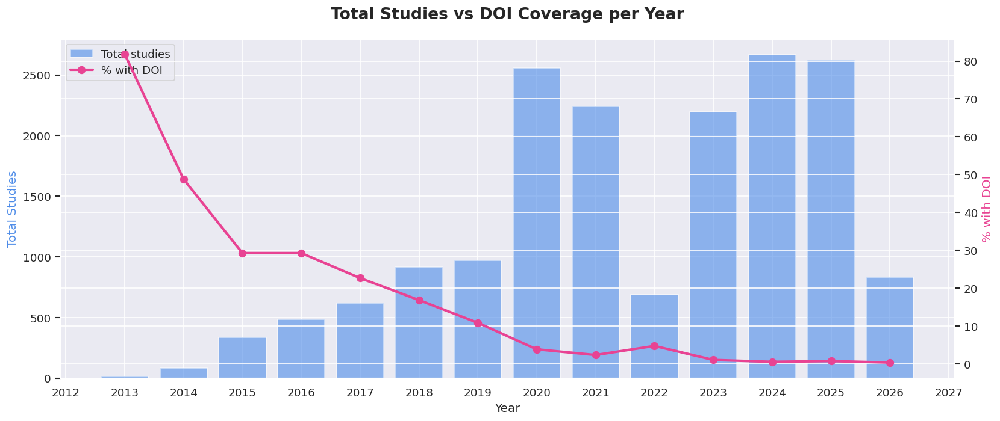
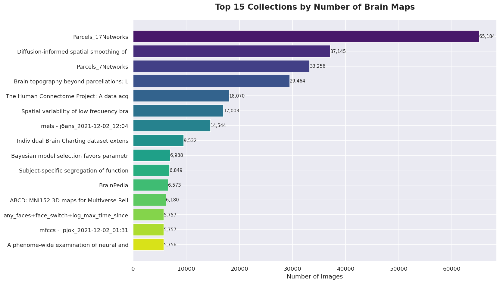

# 🧠 Neurovault Brain Data Analysis

> Exploratory data analysis of real brain imaging studies using the NeuroVault public API.


---

## 📌 About the Project

[NeuroVault](https://neurovault.org/) is a public repository of unthresholded statistical brain maps from real neuroscience research studies worldwide. This project uses its open REST API to extract, clean, analyze, and visualize that data — with no API key required.

The goal is twofold: build a real end-to-end data analysis portfolio project, and explore what the global neuroscience research community looks like through data.

**Questions this project answers:**
- How has brain imaging research grown over time?
- Which institutions publish the most studies?
- What are the most common research modalities (fMRI, MRI, PET...)?
- Are there patterns in how studies are structured?

---

## 🗂️ Project Structure

```
Neurovault-Brain-Data-Analysis/
│
├── data/
│   ├── raw/                  # Original data from the API (CSV)
│   └── processed/            # Cleaned and transformed data
│
├── notebooks/
│   ├── 01_extraction.ipynb       # API consumption & data saving
│   ├── 02_cleaning.ipynb         # Data cleaning with Pandas
│   ├── 03_sql_analysis.ipynb     # SQL queries with SQLite
│   ├── 04_visualization.ipynb    # Charts and visual storytelling
│   └── 05_summary.ipynb          # Key findings and conclusions
│
├── src/
│   └── api_client.py         # Reusable functions for the API
│
├── .gitignore
├── LICENSE
├── README.md
└── requirements.txt
```

---

## 🔧 Tech Stack

| Tool | Purpose |
|------|---------|
| `Python 3.10+` | Main programming language |
| `requests` | HTTP calls to the NeuroVault API |
| `pandas` | Data manipulation and cleaning |
| `sqlite3` | Local database storage and SQL queries |
| `matplotlib` | Data visualization |
| `seaborn` | Statistical charts |
| `jupyter` | Interactive notebooks |

---

## 🚀 Getting Started

### 1. Clone the repository
```bash
git clone https://github.com/Valbu11/Neurovault-Brain-Data-Analysis.git
cd Neurovault-Brain-Data-Analysis
```

### 2. Install dependencies
```bash
pip install -r requirements.txt
```

### 3. Run the first notebook
```bash
jupyter notebook notebooks/01_extraction.ipynb
```

> No API key needed. The NeuroVault API is completely public and free.

---

## 📓 Notebooks

| Notebook | Description | Open |
|----------|-------------|------|
| `01_extraction.ipynb` | Connects to the NeuroVault REST API, handles pagination and saves raw data as CSV | [](https://colab.research.google.com/github/Valbu11/Neurovault-Brain-Data-Analysis/blob/main/notebooks/01_extraction.ipynb) |
| `02_cleaning.ipynb` | Handles null values, fixes data types, parses dates and engineers new features | [](https://colab.research.google.com/github/Valbu11/Neurovault-Brain-Data-Analysis/blob/main/notebooks/02_cleaning.ipynb) |
| `03_sql_analysis.ipynb` | Loads clean data into SQLite and answers business questions with pure SQL | [](https://colab.research.google.com/github/Valbu11/Neurovault-Brain-Data-Analysis/blob/main/notebooks/03_sql_analysis.ipynb) |
| `04_visualization.ipynb` | Creates bar charts, line plots, pie charts and dual-axis charts | [](https://colab.research.google.com/github/Valbu11/Neurovault-Brain-Data-Analysis/blob/main/notebooks/04_visualization.ipynb) |
| `05_summary.ipynb` | Consolidates all findings into a final narrative with charts | [](https://colab.research.google.com/github/Valbu11/Neurovault-Brain-Data-Analysis/blob/main/notebooks/05_summary.ipynb) |

---

## 📊 Key Findings

### 📈 Explosive growth of neuroscience research
Brain imaging research grew from **11 studies in 2013** to **2,665 in 2024** — a **+24,000% increase** in 11 years.
Two major spikes: **2020 (+163%)** driven by COVID-19, and **2023 (+218%)** linked to the rise of AI in neuroscience.

### 🧠 fMRI-BOLD dominates brain imaging
**79.1% of all brain maps use fMRI-BOLD** — confirming it as the gold standard for measuring brain activity.
Only 0.7% use Structural MRI and 0.3% Diffusion MRI.

### 📄 Most studies lack a published DOI
Only **5.5% of collections have a DOI**, suggesting NeuroVault is increasingly used as a
pre-publication data sharing platform rather than a repository for finalized research.

### 🏆 The Human Connectome Project leads by far
**Parcels_17Networks** tops the list with **65,184 brain maps** — nearly double the second largest collection.
The top 5 are all large-scale brain mapping initiatives used as references worldwide.

### 📦 Dataset scale
- **17,216** brain imaging collections analyzed
- **2,000** brain map images processed
- Data spanning **2013 – 2026**
---

## 📈 Visualizations











---

## 🌱 What I Learned

### Technical skills
- **APIs & requests:** How to consume a REST API, handle pagination and save JSON data
- **Pandas:** Data cleaning, type conversion, feature engineering and groupby operations
- **SQL & SQLite:** Creating databases, writing queries with GROUP BY, JOIN, CTEs and subqueries
- **Matplotlib & Seaborn:** Bar charts, line plots, pie charts and dual-axis charts
- **Git & GitHub:** Version control, commit conventions and repository structure
- **Google Colab:** Cloud notebook execution with Google Drive integration

### Domain knowledge
- Understanding of neuroimaging modalities (fMRI-BOLD, Structural MRI, Diffusion MRI)
- Awareness of open science practices in the neuroscience community
- Familiarity with landmark projects like the Human Connectome Project

---

## 📄 License

This project is licensed under the MIT License — see the [LICENSE](LICENSE) file for details.

---

## 🙋 Author

**Valbu11**  
Data Analyst | SQL, Python, Power BI, AI | Commercial Analytics  
[GitHub](https://github.com/Valbu11)
